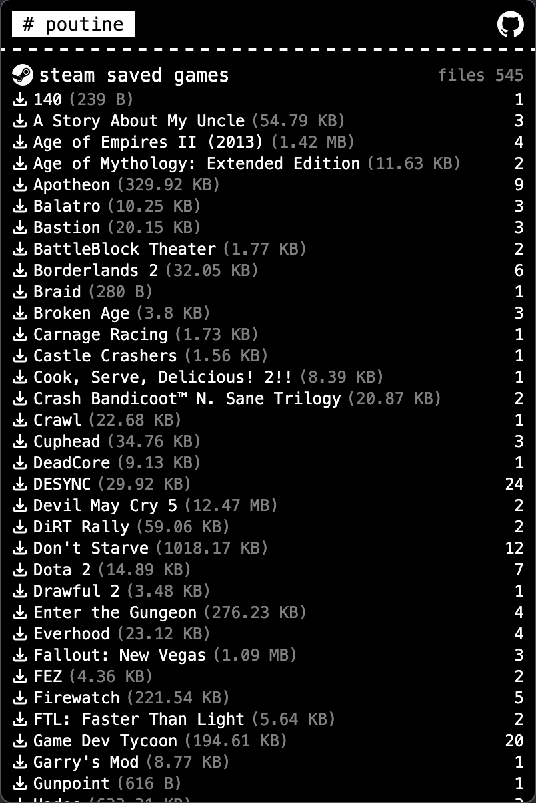

# poutine

a browser extension made to perform backups of cloud accounts. made for personal use.



## supported services

- steam saves
- spotify playlists (todo)
- figma projects (todo)
- instagram posts (todo)

## why an extension?

it's easier to deal with authentication and permissions for various services which do not have appropriate apis to backup data. under the hood, it goes to specific webpages and then scrapes the data.

## development

make sure you have [bun](https://bun.sh) installed

```bash
bun install
bun run dev
```
